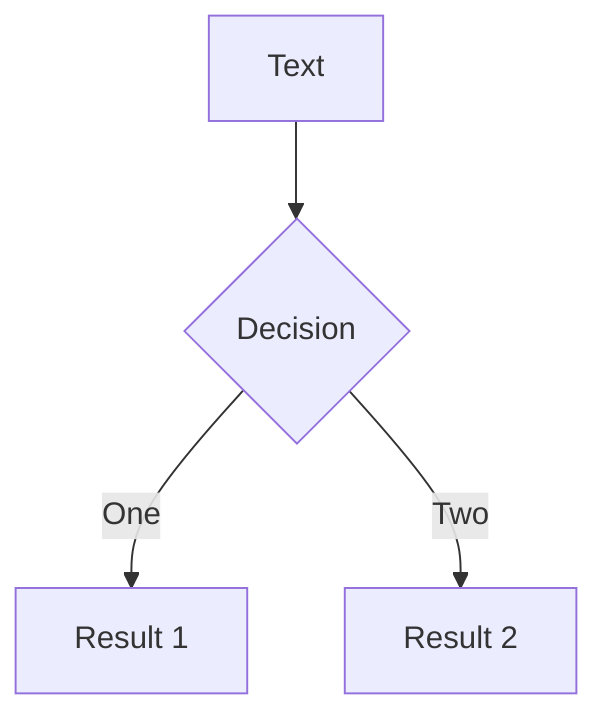

# O <span class="text-pink-500">Backstage</span> do CSS

Bora aprender como o CSS funciona por baixo dos panos?
<div class="justify-center">
  
</div>


---

# "O CSS é fácil de <span class="text-pink-500">aprender</span>, mas difícil de <span class="text-pink-500">dominar</span>"


---

# Code

Use code snippets and get the highlighting directly!

```ts {all|2|1-6|9|all}
interface User {
  id: number
  firstName: string
  lastName: string
  role: string
}

function updateUser(id: number, update: User) {
  const user = getUser(id)
  const newUser = { ...user, ...update }
  saveUser(id, newUser)
}
```

---

# Diagrams

You can create diagrams / graphs from textual descriptions, directly in your Markdown.



---
src: ./pages/multiple-entries.md
hide: false
---
