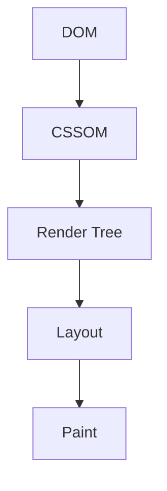

# O <span class="text-pink-500">Backstage</span> do CSS

Bora aprender como o CSS funciona por baixo dos panos?
<div class="justify-center">
  
</div>

---

<div class="flex justify-center">
  
  
  
  
  
</div>

<span class="text-pink-500">**Bianca Pereira**</span>
- <twemoji-laptop /> Sênior frontend developer **@Grupo Boticário**
- <twemoji-books /> Ciências da Computação, MBA em Engenharia de Software
- <twemoji-cat-face /> Mãe de gatos
- <twemoji-cherry-blossom /> Fã de cultura pop asiática
- <twemoji-hot-beverage /> **Líder de comunidade [@Cafeina Vagas](https://t.me/CafeinaVagas) no Telegram**

---

# "O CSS é fácil de <span class="text-pink-500">aprender</span>, mas difícil de <span class="text-pink-500">dominar</span>"


---

### Transformando código em pixels

- Entender como o browser funciona
- Cada navegador tem sua forma de renderizar o conteúdo na tela
- Performance <twemoji-rocket />
- <span class="text-pink-500">Critical Rendering Path</span> **(CRP)**

---

### 5 passos do CRP



---

### Fase 1 - <span class="text-pink-500">DOM</span> (Document Object Model)

- Árvore criada a partir do HTML
- A árvore é composta de vários nós (nodes)
- Se organiza de forma hierárquica

<div class="justify-center">
  
</div>

---

### Fase 2 - <span class="text-pink-500">CSSOM</span> (CSS Object Model)

- Árvore criada a partir do CSS
- Estrutura similar a árvore DOM
- Essa árvore é criada de forma <span class="text-pink-500">muito rápida</span>
- Seletores mais específicos são mais rápidos do que os menos específicos

```css
.titulo {}
.titulo span {}
```

---

### Fase 3 - <span class="text-pink-500">Render Tree</span>

- Nesta fase, o browser combina as duas árvores (DOM e CSSOM)
- O navegador checa cada nó e verifica se ele tem um estilo associado
- Nós **invisíveis** não estão presentes na render tree (`display: none`)

<div class="justify-center">
  
</div>

---

<div class="justify-center">
  
</div>

<p class="text-xs">
  Fonte: <a href="https://vvaibhavdesai.hashnode.dev/stonks-guide-to-critical-rendering-path">https://vvaibhavdesai.hashnode.dev/stonks-guide-to-critical-rendering-path</a>
</p>

---

### Fase 4 - Layout

- É o processo que determina o tamanho e o posicionamento de cada elemento da página

---

### Fase 5 - Paint

- É o processo de painting

---

<h1 class="flex">
  <span class="m-5">Obrigada!</span>
  
</h1>

- Linkedin: https://www.linkedin.com/in/biancacpereira
- Twitter: https://twitter.com/BiaSaliorGeek
- Intagram: https://www.instagram.com/biibis_
- Github: https://github/biancapereira

> **Comunidade para Iniciantes em TI [@CafeínaVagas](https://t.me/CafeinaVagas) <twemoji-hot-beverage /> no Telegram**
